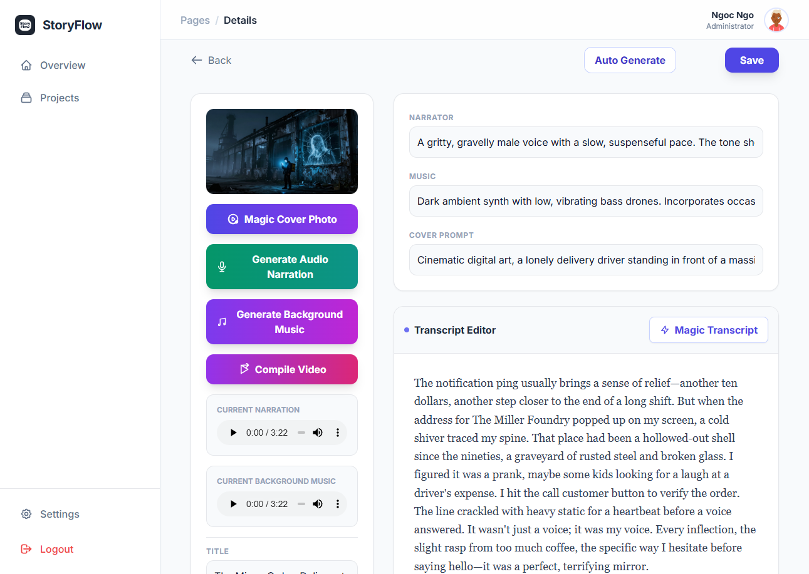

# StoryFlow

StoryFlow is an authenticated AI storytelling studio for creating and managing story projects end-to-end:

- generate transcript drafts from a summary
- generate cover images
- generate narration audio
- generate background music
- compile a final video
- save media to Supabase storage and optionally post to YouTube

It uses Supabase for auth/data/storage, Redux for app state, and pluggable generation providers (Gemini + ComfyUI).

## Current Features



### App pages

- **Login / Sign Up** via Supabase Auth
- **Overview dashboard** with project stats + recent activity
- **Projects** list with status filter and AI idea generation
- **Story Detail** editor with transcript + metadata + media generators

### Generation tools in Story Detail

- **Magic Transcript** (text generation)
- **Cover generation** (image generation)
- **Narration generation** (TTS)
- **Background music generation**
- **Video compilation** (WebM) with:
  - local preview
  - download
  - save to Supabase storage
  - post to YouTube
- **Auto Generate** pipeline to run selected steps in sequence

### Settings (stored in localStorage)

- Provider config per generation type (`text`, `image`, `narration`, `music`)
- Gemini API key + model names
- ComfyUI endpoint/API key/model
- Image settings (width/height/cfg)
- Narration settings (voice/speed)
- Video effects toggles (Ken Burns / Particles)
- YouTube OAuth client + default privacy + token reuse

## Tech Stack

- React 19 + TypeScript + Vite
- Redux Toolkit + React Redux
- React Router (HashRouter)
- Supabase (`@supabase/supabase-js`)
- Google GenAI SDK (`@google/genai`)
- Recharts (dashboard visuals)
- MediaBunny + browser media APIs for video compilation

## Provider Capability Matrix

| Generation type | Gemini | ComfyUI |
| --- | --- | --- |
| Text / transcript / ideas | ✅ | ❌ |
| Cover image | ✅ | ✅ |
| Narration audio | ✅ | ❌ |
| Background music | ❌ | ✅ |

If you set an unsupported provider for a generation type, StoryFlow will surface an error in the UI.

## Local Development

### Prerequisites

- Node.js 20+
- A Supabase project
- A Gemini API key (required for text and narration, optional for image if using ComfyUI)
- A ComfyUI endpoint (required for music, optional for image)

### 1) Install dependencies

```bash
npm install
```

### 2) Configure Supabase project connection

This repo currently has Supabase URL/anon key defined directly in `supabaseClient.ts`.

Update these values to your own project before running in shared/public environments.

### 3) Create database schema + storage

Run `supabase_schema.sql` in your Supabase SQL editor.

This sets up:

- `profiles` and `stories` tables
- RLS policies
- storage buckets/policies for generated assets

### 4) Run the app

```bash
npm run dev
```

Then open the local Vite URL (usually `http://localhost:5173`).

## First-Time App Setup (inside UI)

1. Sign up / log in.
2. Open **Settings**.
3. In **Provider** tab:
   - paste Gemini API key
   - set ComfyUI endpoint if using Comfy-based generation
4. In generation tabs, choose provider per task type.
5. Create a new project from **Overview** or **Projects**.

## Typical Workflow

1. Create project (or generate project ideas in bulk).
2. Fill title + summary.
3. Generate transcript.
4. Generate cover + narration (+ music if configured).
5. Compile video.
6. Save video to cloud and/or download.
7. Optionally post compiled video to YouTube.

## YouTube Upload Setup

To enable the **Post to YouTube** action:

1. In Google Cloud Console, create/select a project.
2. Enable **YouTube Data API v3**.
3. Configure OAuth consent screen.
4. Create an OAuth 2.0 Client ID (**Web application**).
5. Add your app origin to **Authorized JavaScript origins**.
   - local dev example: `http://localhost:5173`
6. In StoryFlow: **Settings → Provider → YouTube Upload**:
   - paste OAuth Client ID
   - click **Authorize YouTube**
   - choose default privacy (`unlisted` / `private` / `public`)

Uploads use story title, summary/transcript, tags, and selected privacy status.

## NPM Scripts

- `npm run dev` — start local dev server
- `npm run build` — production build
- `npm run preview` — preview production build locally

## Project Structure (high level)

- `pages/` — routed screens (`Home`, `Projects`, `StoryDetail`, `Login`)
- `components/` — generators, settings tabs, layout, dialogs
- `services/ai/` — provider factories, prompts, storage utilities
- `services/youtube.ts` — OAuth token flow + upload logic
- `store/` — Redux slices for stories/config/UI
- `context/AuthContext.tsx` — Supabase auth session handling

## Notes

- StoryFlow uses `HashRouter`, which is friendly for static hosting.
- Transcript generation is designed around a soft character limit (`3000`) for narration generation.
- Video compilation depends on modern browser media APIs; Chromium-based browsers are recommended.
